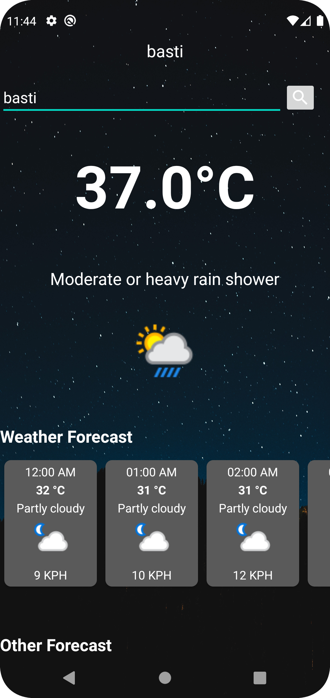

<h2>NotesApp</h2>

<table border="0">
  <tr>
    <td></td>
  </tr>
 </table>

 <h3>Language:</h3>
<li>Java</li>

<h3>API:</h3>
<li>weatherapi</li> <a href="https://www.weatherapi.com/">weatherapi.com</a>

<h3>IDE:</h3>
<li>Android Studio</li>

<h3>Upcoming features:</h3>
<li>Everyday forecast view</li>
<li>Add multiple locations forecast details</li>
<li>Add forecast to home screen widget</li>
